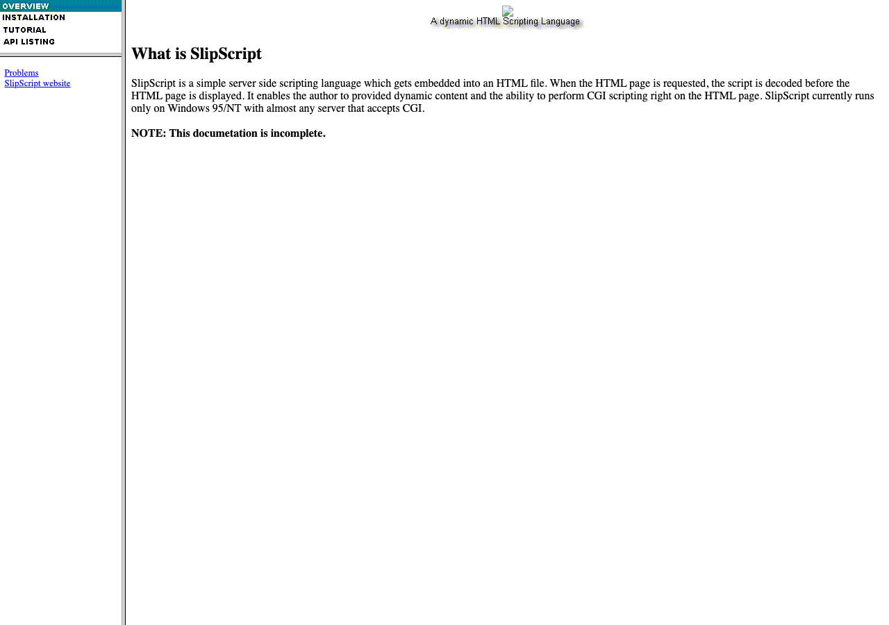
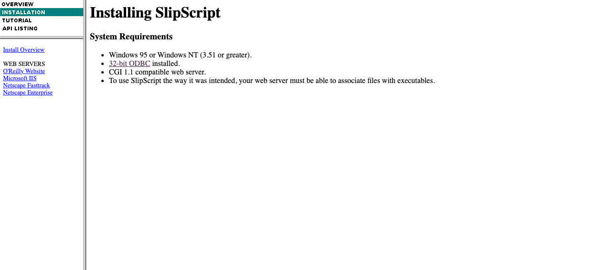
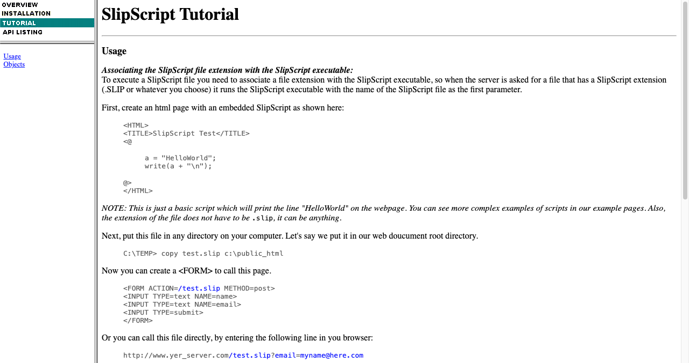
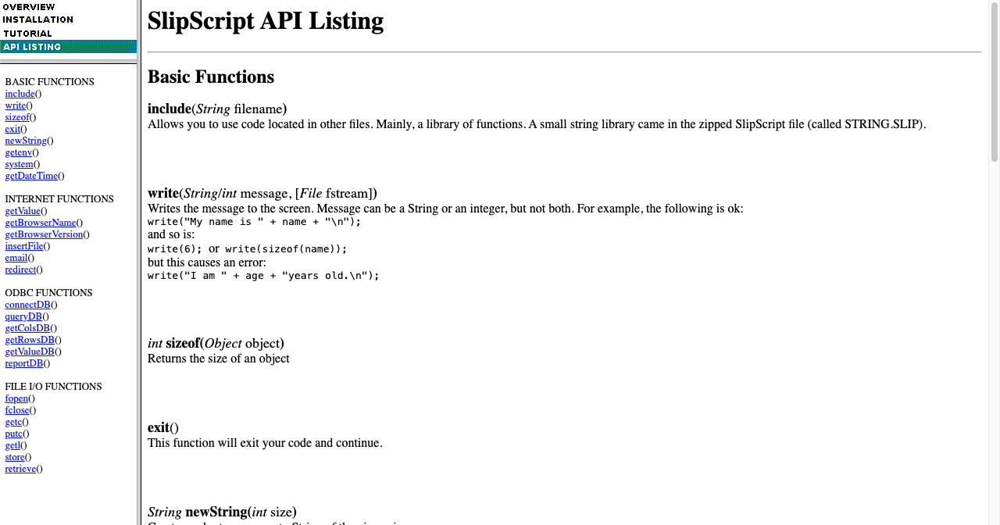

# SlipScript Original Website

This directory contains the original SlipScript documentation website from 1994-1995, preserved with its classic frameset design and mid-90s web aesthetic.

## Viewing the Website

**Local Server:**

```bash
cd docs/website
python3 -m http.server 8000
# Open http://localhost:8000/index.html
```

**Direct File:**

```bash
open docs/website/index.html
```

## Screenshots

### Overview Page


_The main landing page explaining what SlipScript is and its purpose for server-side scripting on Windows 95/NT._

### Installation Guide


_System requirements and installation instructions for setting up SlipScript with Windows web servers._

### Tutorial Section


_Step-by-step tutorials for creating dynamic HTML pages with embedded scripts._

### API Reference


_Complete API documentation for SlipScript functions, CGI integration, and database operations._

## Documentation Sections

### 1. Overview

- What is SlipScript
- Key features
- System requirements
- Links to additional resources

### 2. Installation

- **FastTrack**: Quick setup guide
- **Enterprise**: Production deployment
- **IIS**: Internet Information Server configuration
- **Website**: Web server integration

### 3. Tutorial

- Getting started
- Script syntax (`<@ ... @>` blocks)
- Variables and expressions
- CGI integration
- Database access

### 4. API Listing

- Built-in functions
- HTTP/CGI variables
- Database operations (ODBC)
- File I/O
- Utility functions
